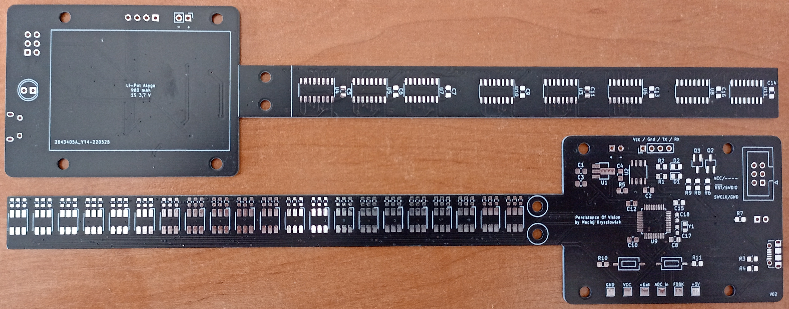
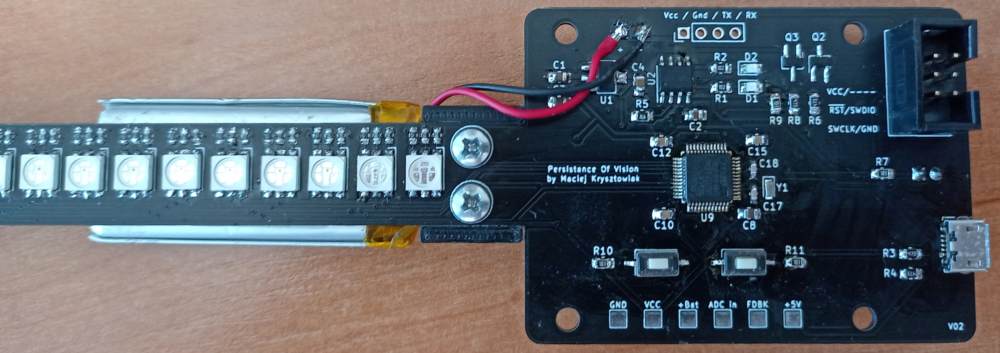
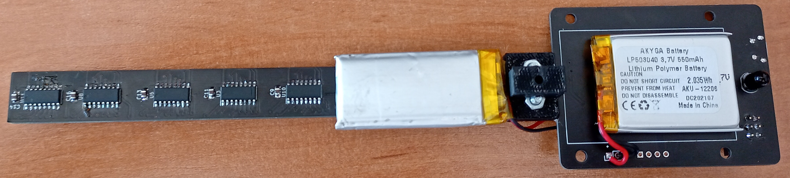
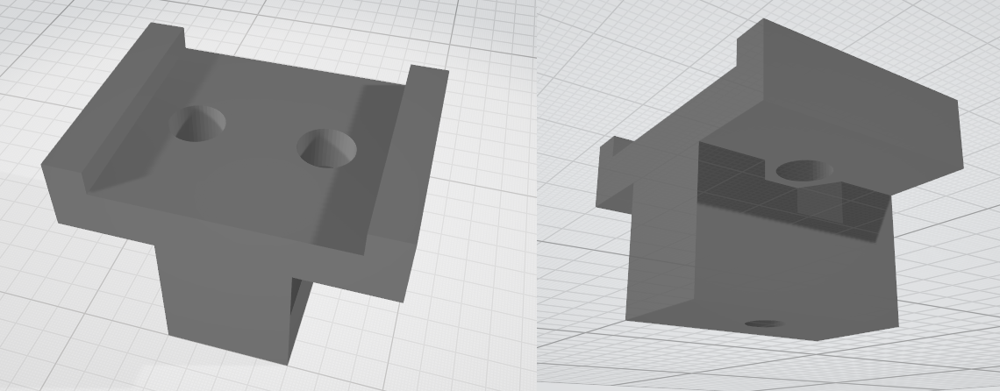
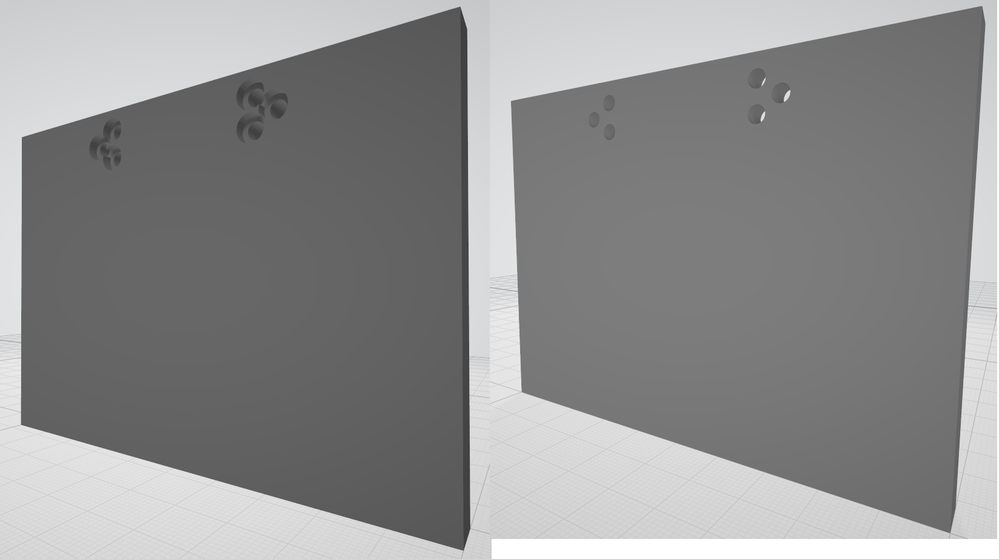
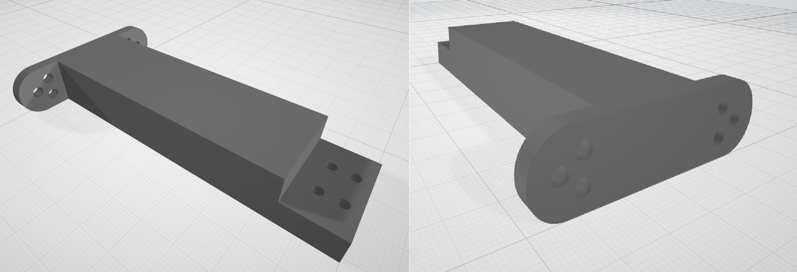
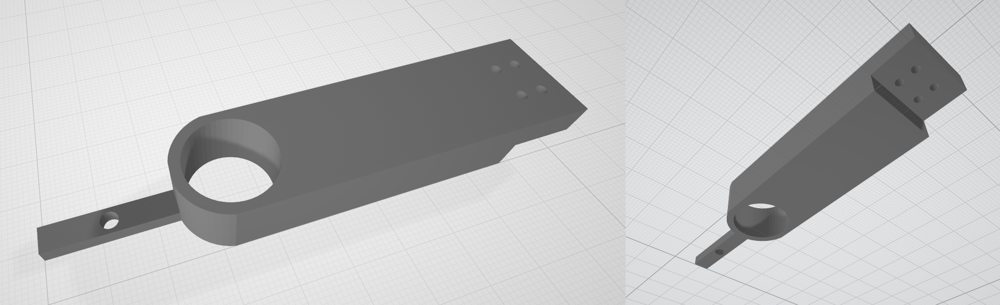

# PERSISTANCE OF VISION DISPLAY

## Principle

The working principle of persistance of vision display is that human eye cannot process more than 12 images per second. So by turning on and off moving LEDs it is possible to create an illusion of a stationary image.

## Electronics

As the main purpose of this display is to have a fancy wall clock, one of the main concerns in electronics design was power usage. That's why I decided to use STM32L051C8 as the main MCU, due to its low power usage, high computational capabilities and my familiarity with STM's HAL interface. Power supply consists of Li-Po battery and 2.5V low dropout voltage regulator. Charging battery is done via micro-USB port with TP4056 IC. For driving LEDs I chose a combination of classical 74HC595 8-bit SIPO registers and current limiting resistors. Photodiode is used for calculating rotation time.

Using the KiCad software I came up with following schematic:

And PCB design:

Board after assembling:

After I glued the main battery in the board wasn't balanced and after trying few methods, I stuck with adding 2nd battery for increased battery life in addition to balancing the PCB.

## MECHANICS

Rotor holder used for connecting the PCB to rotor using two pairs of M3 nuts and bolts.

Motor hodler was printed in 3 separate part because my 3D printer was too small. Parts are mounted together using M3 and M4 nuts and bolts. Motor holder also embeds IR LED.

All parts were printed with ABS material.

## SOFTWARE

### IMAGE COMPILER

Python script used for coverting images into a C-style array, that could be programmed into the MCU.

### Embedded

Project was made in VSCode using [stm32-for-vscode](https://www.st.com/en/development-tools/stm32cubemx.html) extension. For this project I used [stm32CubeMX](https://github.com/bmd-studio/stm32-for-vscode) for generating initialization. There are 2 main modes that the display can work in:

- Analog Clock - Mimics classical analog clock
- Image - Displays stationary images, precompiled with python script

Modes and parameters can be chosen via *config.h* file.
